## IRMA-SPY Documentation

 _**This documentation assumes you have the four required Docker containers already running. If not, please start with [setup instructions](./README.md)._

## Contents
1. [Stage your fastqs](#stage-your-demultiplexed-data)
2. [Running genome assembly with IRMA-SPY](#run-genome-assembly-with-irma-spy)
3. [Reviewing IRMA results](#review-irma-results)
4. [Download your fasta](#save-your-sequence-fasta)

## Stage your demultiplexed data
1. In your "FLU_SC2_SEQUENCING" folder, make a folder for your run. It is very helpful to name your runs with a consistent naming system, such as "YEAR-MONTH-DATE-FLOWCELL_ID", ie. 2022-11-13-ABC1234. **_DO NOT PUT SPACES OR SLASHES IN YOU RUN FOLDER NAMES!_**
2. Copy the run's demultiplexed fastqs into the RUN-FOLDER.
    1. If this run is from an Oxford Nanopore Technologies' (ONT) sequencer, copy the "fastq_pass" directory from the sequencer's output into the RUN-FOLDER. On a Mk1C instrument, this is found in /data/RUN_NAME/EXPERIMENT_NAME/NANOPORE-NAME/fastq_pass where RUN_NAME and EXPERIMENT_NAME are defined by you in MinKNOW when you set up the sequencing run on the device and the NANOPORE-NAME is created by the instrument during the run.
    2. If this run is from an Illumina instrument, create another folder inside your RUN-FOLDER called "fastqs" and copy the folder containing demultiplexed fastqs into this newly created fastqs folder so that the folder structurs is FLU_SC2_SEQUENCING/RUN-FOLDER/fastqs/demultiplexed-fastqs/sample-reads.fastq. There will be two fastq files per sample.
3. Copy the run's demultiplexing summary file into the RUN-FOLDER.
    1. From ONT, this file is in the folder that also contains the "fastq_pass" folder and is called "sequencing_summary.txt".
    2. From Illumina, this file is called "laneBarcode.html".

[Return to contents](#contents)

## Run genome assembly with IRMA-SPY
1. Open Docker Desktop and navigate to the `Containers` tab on the left sidebar. Assure that the following containers are running or run each of them:
    1. irma-1.0.2p3
    2. dais-ribsome-1.2.1
    3. sc2-spike-seq
    4. irma-spy
    
    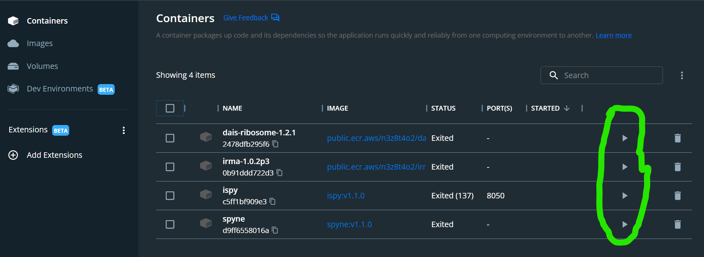
2. Run IRMA-SPY by clicking the icon of the box with the arrow pointing to the top left. This will open IRMA-SPY into your defa ult internet browser.

    
3. Click the `REFRESH RUN LISTING` button and select your run from  the dropdown box.

    

4. Now, enter your `Barcode numbers`. Usually you will be running a simple range of barcode numbers, such as "1-24", but to allow for flexibilty, barcode numbers can be entered in a list combining both single numbers and number-ranges, such as "1-3,5,9,12-20". Now enter your `Sample ID`s. These can be copy and pasted from a column in an excel sheet. Sample names should only be numbers, letters, and underscores ("_"). **Do not use any other characters such as "-" or "/".** Next, select your `Sample Type`. Most of your sample's are test samples, so each row defaults to `test`, but select `- control` or `+ control` for your **negative** and **positive** controls, respectively. Finally, select the `Barcode Expansion Pack` you have    used during library preparation. This is most likely "EXP-PBC09    6".

    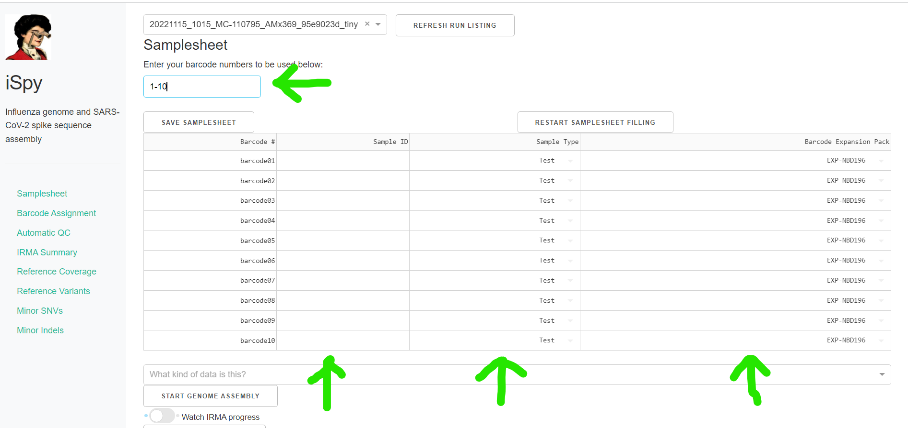

5. Click `Export` above the samplesheet to download this table as "Data.csv". Move this file into your **run** directory under `FLU_SC2_SEQUENCING` and rename it "samplesheet".

    
    
    

6. Return to `IRMA-SPY` and **refresh** the webpage. Now select the correct data type from the drop down box, `What kind of data is this?` and click `START GENOME ASSEMBLY`. Now is a good time to go have a coffee. :coffee:

    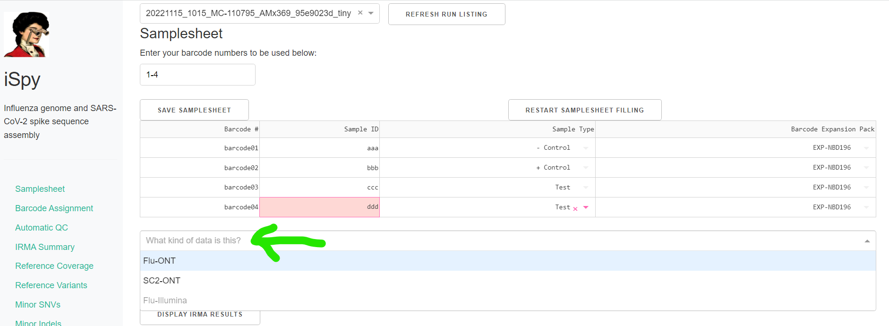

    Click on the toggle button `Watch IRMA Progress`. Assembly will take some time, how long exactly is dependent on your sample number, the number of raw sequencing reads, and the power of your computer.
    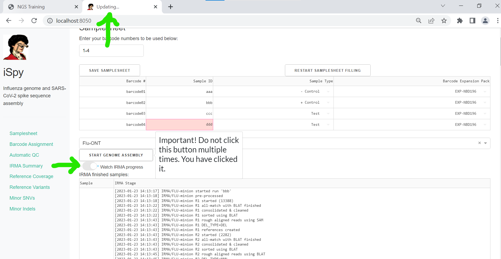

7. When IRMA has finished, `refresh` the webpage and click on `DISPLAY IRMA RESULTS`. 

    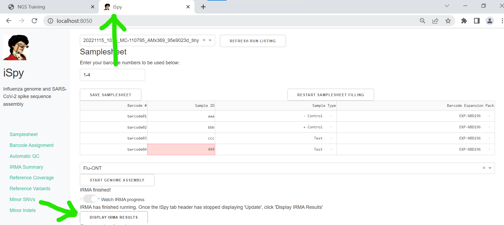

[Return to contents](#contents)

## Review IRMA results

1. Review `Irma Summary`.

    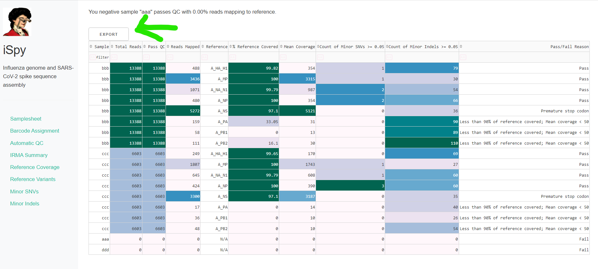

2. Review genome coverage depth.

    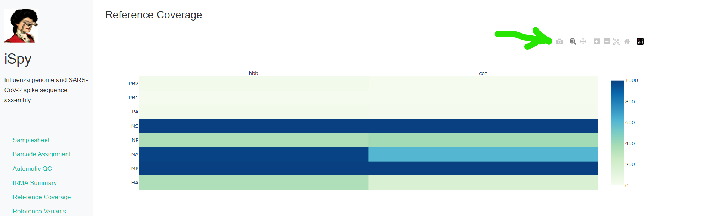
    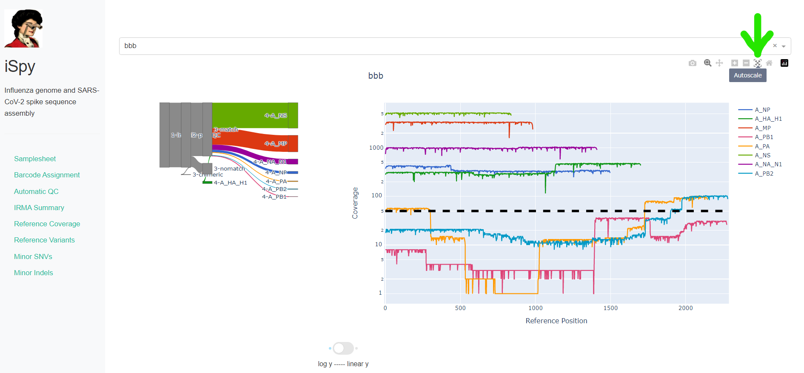

3. Inspect amino acid variants against popular reference sequences

    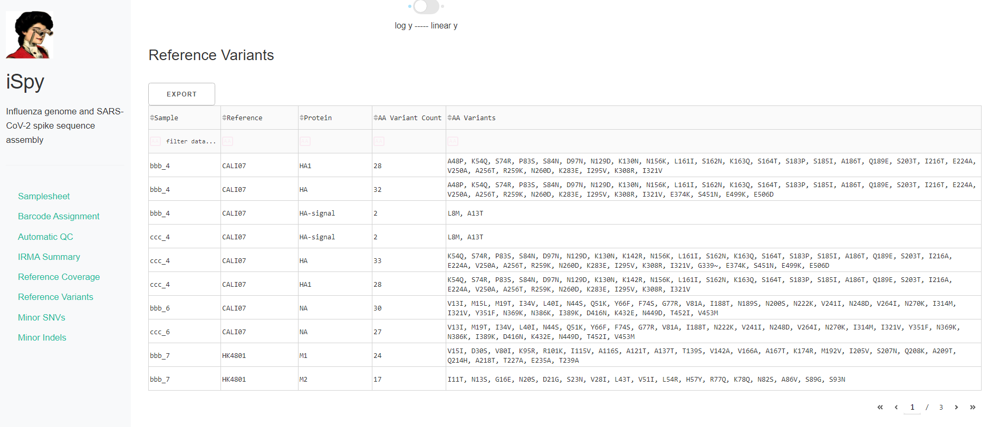

4. Inspect minor variation at single nucleotides, insertions and deletions _relative to the sample's generated consensus sequence._ 

    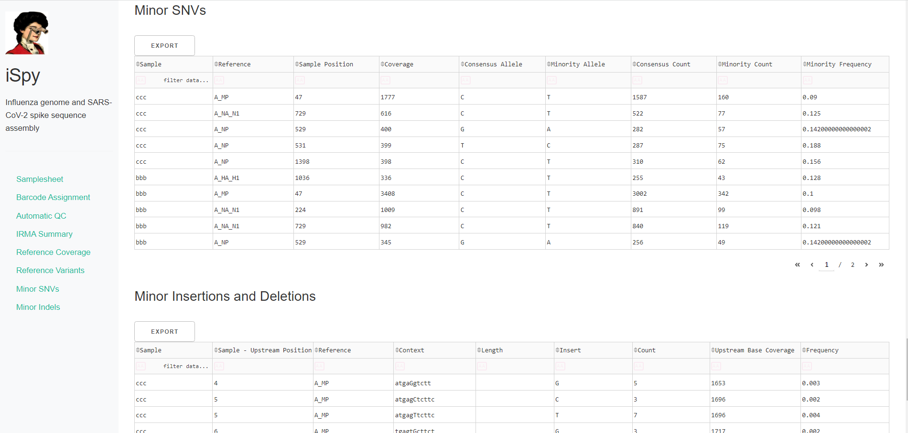

[Return to contents](#contents)

## Save your sequence fasta

- Export IRMA's _amended consensus_ sequences fasta file.

    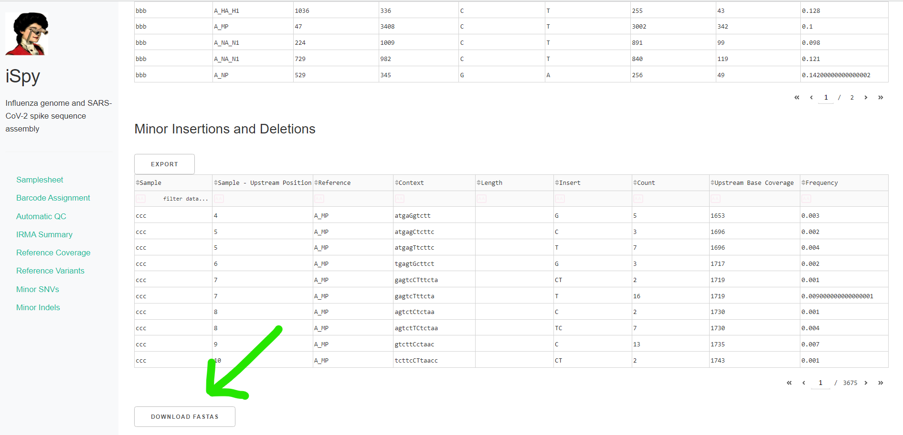

 

[Return to contents](#contents)

[Return to IRMA-SPY computer setup](./README.md)
