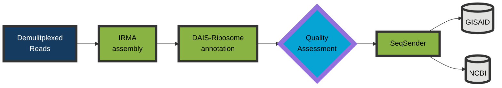
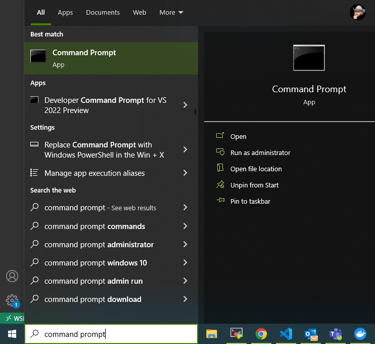
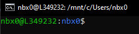
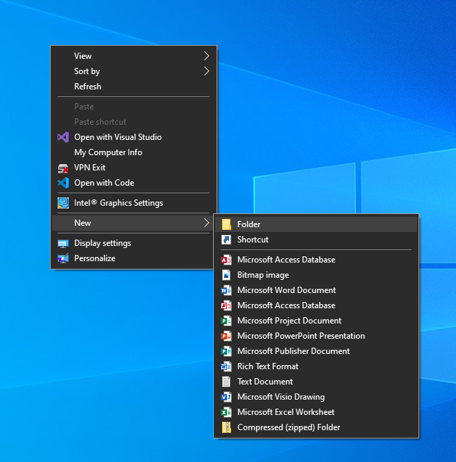
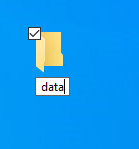

# Protocol for Influenza genome and SARS-CoV-2 spike-only assembly and curation
### Start with demultiplexed sequencing reads from an Illumina or Oxford Nanopore Technologies sequencer and finish with high quality genomes submitted to public repositories!

#

## Computer requirements
- A minimum of 16GB of memory is required. >=32GB is recommended.
- A minimum of 8 CPU cores is recommended.
- Administrative privileges are required on a Windows operating system _to run linux_.
- A linux operating system is required.
#

## How to install linux on a Windows 10 computer
You can get a full linux environment using Windows Subsystem for Linux, or WSL. The second version of WSL is WSL2 and is the recommended version to use.
- [Windows instructions are here](https://docs.microsoft.com/en-us/windows/wsl/install)
- [Similar instructions on protocol.io](https://www.protocols.io/view/install-wsl-and-vscode-on-windows-10-q26g78e1klwz/v1)
#

## How to use WSL2
1. Click the Windows Logo in the bottom left corner of the screen and type "command prompt" 
 

2. Type "wsl" and hit Enter: 
    ```.net
    C:\Users\username> wsl
    ``` 
    which will change your command prompt to:
     but with your username@computername:usename$

## Set up your /data directory on your desktop and navigate to it with WSL2
1. Make a data directory somewhere, ie. right-click the desktop:
    

    
2. Navigate to your data directory by copying and pasting the following command into Command Prompt
    ```bash
        cd /mnt/c/Users/$(whoami)/Desktop/data # This assumes that when you set up WSL2 you made your USERNAME the same name as you use to log in to Windows. If not, replace "$(whoami)" with that username.
    ```
#

## [Install Docker](https://www.docker.com/products/docker-desktop/)
Docker allows you to run software inside an isolated "container image" on your computer with all of that application's needed dependencies. Make sure to install the version for your operating system. Here we are assuming [Windows](https://desktop.docker.com/win/main/amd64/Docker%20Desktop%20Installer.exe?utm_source=docker&utm_medium=webreferral&utm_campaign=dd-smartbutton&utm_location=header).
#

## [Install Bio Edit](https://bioedit.software.informer.com/)
We will use BioEdit to look at consensus sequences.
#

## Click the links below for directions to analyze your fastqs
## [Influenza](./docs/influenza.md)
or
## [SARS-CoV-2 spike](./docs/sc2spike.md)
