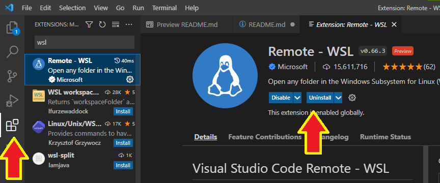

# Protocol for Influenza genome and SARS-CoV-2 spike-only assembly and curation
### Start with demultiplexed sequencing reads from an Illumina or Oxford Nanopore Technologies sequencer and finish with high quality genomes submitted to public repositories!

```mermaid
flowchart LR
A[Demulitplexed\nReads] --> B[IRMA\nassembly]
B --> C[DAIS-Ribosome\nannotation]
C --> D{Quality\nAssessment}
D --> E[SeqSender]
E --> F[(GISAID)]
E --> G[(NCBI)]

style A fill:#153b60
style B fill:#89b342,color:#000000,stroke:#333,stroke-width:5px
style C fill:#89b342,color:#000000,stroke:#333,stroke-width:5px
style D fill:#06a4d5,color:#000000,stroke-width:10px
style E fill:#89b342,color:#000000,stroke:#333,stroke-width:5px
style F fill:#e3e3e2,color:#000000,stroke:#333,stroke-width:5px
style G fill:#e3e3e2,color:#000000,stroke:#333,stroke-width:5px
```

#

## Computer requirements
- A minimum of 16GB of memory is required. >=32GB is recommended.
- A minimum of 8 CPU cores is recommended.
- Administrative privileges are required on a Windows operating system _to run linux_.
- A linux operating system is required.
#

## How to install linux on a Windows 10 computer
You can get a full linux environment using Windows Subsystem for Linux, or WSL. The second version of WSL is WSL2 and is the recommended version to use.
- [Windows instructions are here](https://docs.microsoft.com/en-us/windows/wsl/install)
- [Similar instructions on protocol.io](https://www.protocols.io/view/install-wsl-and-vscode-on-windows-10-q26g78e1klwz/v1)
#

## How to use WSL2
### Option 1: "Command Prompt" 
Click the Windows Logo in the bottom left corner of the screen and type "command prompt" 
 

### Option 2: "VS Code"
VS Code is an Integrated Development Environment (IDE) that you can use for editing text documents, writing code and so much more. 

1. [Download VS Code](https://code.visualstudio.com/)

2. [Windows directions](https://code.visualstudio.com/blogs/2019/09/03/wsl2)

3. Open VS Code and install the WSL-remote by clicking on the 'boxes' logo in the left tool bar, type "wsl" and select "Remote-WSL" and install it.

4. 
#

