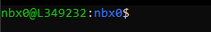

## Protocol for Influenza genome and SARS-CoV-2 spike-only assembly and curation
<hr>

### Start with demultiplexed sequencing reads from an Illumina or Oxford Nanopore Technologies sequencer and finish with high quality genomes ready for submission to public repositories!
<hr>


## Computer requirements
- A minimum of 16GB of memory is required. >=32GB is recommended.
- A minimum of 8 CPU cores is recommended.
- **Administrative privileges are required on a Windows operating system _to run linux_.**
- A linux/unix (includes Intel-based* MacOS) operating system is required.
    - *This software has not yet been tested on Apple's M-chip based OS
    - If you are using a Mac, [skip to installing Docker](#install-docker-desktophttpswwwdockercomproductsdocker-desktop)


## How to install linux on a Windows 10/11 computer
You can get a full linux environment using Windows Subsystem for Linux, or WSL. The second version of WSL is WSL2 and is the recommended version to use.

1. Check your Windows version and build number, select Windows logo key + R, type winver, select OK.
2. Windows 10 version 2004 and higher (Build 19041 and higher) or Windows 11 is required.
   - You can update to the latest Windows version by selecting Start > Settings > Windows Update > Check for updates.
3. <a href="./images/powershell_open.png" target="_blank">Run powershell **as administrator**</a>
4. Run the following command in Powershell:
    ```bash
    wsl --install
    ```
5. Restart your computer
6. Reopen Powershell and enter the following commands:
    ```bash
    wsl --set-default-version 2
    wsl --install -d Ubuntu-18.04
    ```
    Following successful installation, an Ubuntu terminal should pop up that looks like:
    
7. Enter a username that will be exclusive for WSL. Press `Enter` and then enter a password. A "prompt" will then appear in the screen like:
     with `nbx0` replaced by your entered username and `L349232` replaced with your computer's name.
8. Restart your computer.

- To access the Ubuntu terminal in the future, simply search for `Ubuntu` in the <a href="./images/ubuntu_open.png" target="_blank">Window's task bar and click on the app.</a> 
<br/><br/>
Further details can be found on Microsoft's website here: [https://docs.microsoft.com/en-us/windows/wsl/install](https://docs.microsoft.com/en-us/windows/wsl/install)
<br/><br/>

## Map network drive to be able to use Window's File Explorer to see folders and files inside WSL
_These instruction are for Windows 10 OS._
1. Open <a href="./images/file_explorer.png" target="_blank">File Explorer</a>
2. Right click <a href="./images/map_drive_1.png" target="_blank">This PC and click Map network drive</a>
3. Enter `\\wsl$` into Folder: <a href="./images/map_drive_2.png" target="_blank">and click Browse</a>
4. Click on `wsl$` to unfold directories, select `Ubuntu-18.04` <a href="./images/map_drive_3.png" target="_blank">and click OK</a> and then `Finish`. You should now see your WSL "drive" available in `File Explorer`:
    
    


## [Install Docker Desktop](https://www.docker.com/products/docker-desktop/)
Docker allows you to run software inside an isolated "container image" on your computer with all of that application's needed dependencies. Make sure to install the version for your operating system.
- [Windows](https://desktop.docker.com/win/main/amd64/Docker%20Desktop%20Installer.exe?utm_source=docker&utm_medium=webreferral&utm_campaign=dd-smartbutton&utm_location=header)
- [Mac-Intel](https://desktop.docker.com/mac/main/amd64/Docker.dmg?utm_source=docker&utm_medium=webreferral&utm_campaign=dd-smartbutton&utm_location=module)
- [Mac-AppleChip](https://desktop.docker.com/mac/main/arm64/Docker.dmg?utm_source=docker&utm_medium=webreferral&utm_campaign=dd-smartbutton&utm_location=module)
- [Linux](https://docs.docker.com/desktop/linux/install/).

## [Install Docker CLI (Command Line Interface) in WSL2](https://docs.docker.com/engine/install/ubuntu/)
1. Open Ubuntu
2. Uninstall old versions of Docker
    ```bash
    sudo apt-get remove docker docker-engine docker.io containerd runc
    ```
3. Tell WSL2 where to look for Docker CLI tools
    ```bash
    sudo apt-get update
    sudo apt-get install \
    ca-certificates \
    curl \
    gnupg \
    lsb-release
    ```

    - During installation, you will be prompted multiple times to enter 'y' or 'n' on preceeding. Each time, input 'y' and click `Enter`
    
    ```bash
    sudo mkdir -p /etc/apt/keyrings
    curl -fsSL https://download.docker.com/linux/ubuntu/gpg | sudo gpg --dearmor -o /etc/apt/keyrings/docker.gpg
    ```

    ```bash
    echo \
    "deb [arch=$(dpkg --print-architecture) signed-by=/etc/apt/keyrings/docker.gpg] https://download.docker.com/linux/ubuntu \
    $(lsb_release -cs) stable" | sudo tee /etc/apt/sources.list.d/docker.list > dev/null
    ```
4. Install Docker CLI
    ```bash
    sudo apt-get update
    ```

    ```bash
    sudo chmod a+r /etc/apt/keyrings/docker.gpg
    sudo apt-get update
    ```

    ```bash
    sudo apt-get install docker-ce docker-ce-cli containerd.io docker-compose-plugin
    ```
5. Verify successful installation
    ```bash
    sudo docker run hello-world
    ```
    - This command downloads a test image and runs it in a container. When the container runs, it prints a confirmation message and exits.
    - Whenever you enter the `sudo` command, you will be prompted for your WSL2 password.

## Install a sequence viewer
- [Windows Bio Edit](https://bioedit.software.informer.com/)
- [Mac Aliview](https://ormbunkar.se/aliview/#DOWNLOAD)


## Instructions for running IRMA-SPY:
1. [Setup Docker containers](./docs/container_setup.md)

