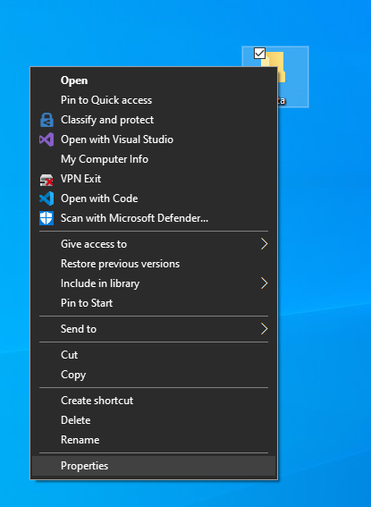
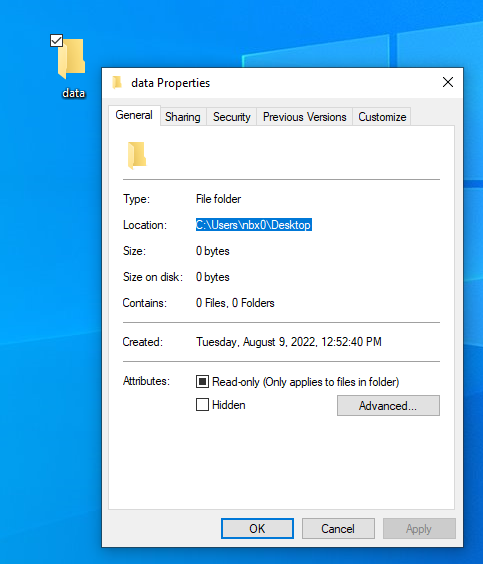

## How to mount a Windows drive from WSL2 (including network mapped drives)

1. Get the path to your data dir by right clicking the folder and clicking "properties" and then copy the "Location" to your clipboard
    

    
2. Mount WSL2 to your data directory. Copy and paste the following into your command prompt:
    ```bash
        cd ~
        mkdir data
        sudo mount -t drvfs C:\Users\nbx0\Desktop:~/data
    ```
